# 프로젝트 소개

**금융 서비스 웹 개발 프로젝트**

## 👥 팀원 소개

- 조현준 : 팀장
- 조기흠 : 팀원

## 🎭 역할 소개

### 조현준

#### 1. 금융 상품 조회

- **[금융감독원 오픈API](https://finlife.fss.or.kr/finlife/main/contents.do?menuNo=700029)** 활용
- 예금 & 적금 상품 조회
- 예금 & 적금 상품 상세 조회
- 필터 기능 구현

#### 2. 가까운 은행 찾기

- **[카카오 맵 API](https://apis.map.kakao.com/web/guide/)** 활용
- 시/도, 시/군/구, 은행 브랜드 선택시 지도에 은행 위치 표시

#### 3. 환율 계산기

- **[ExchangeRate-API](https://www.exchangerate-api.com/)** 활용
- 국가 선택 후, 원화 또는 해당 국가 화폐 입력 시, 환율 자동 계산

#### 4. 챗봇

- **[OpenAI API](https://platform.openai.com/docs/overview)** 활용
- 웹 서비스 관련 링크나 사용서 관련 챗봇

#### 5. 메인 페이지 레이아웃 설계 및 디자인 총괄

- <b>[Vuetify3](https://vuetifyjs.com/en/getting-started/installation/#installation)</b>를 활용
- 차트 기능은 <b>[chart.js](https://www.chartjs.org/docs/latest/)</b> 및 <b>[vue-chartjs](https://vue-chartjs.org/guide/)</b> 를 활용

### 조기흠

#### 1. 회원

- <b>[dj-rest-auth](https://dj-rest-auth.readthedocs.io/en/latest/introduction.html)</b>, <b>[django-allauth](https://docs.allauth.org/en/latest/)</b> 활용
- 회원 가입, 탈퇴, 정보 수정
- 로그인/로그아웃 구현
- 프로필 페이지 구현
- User 모델 커스텀 및 커스텀 필드 생성

#### 2. 게시판

- 게시글 생성, 조회, 수정, 삭제
- 댓글 생성, 조회, 수정, 삭제

#### 3. 추천시스템

- pandas 및 scikit-learn을 활용한 데이터 분석
- 코사인 유사도를 활용한 유저 기반 협업 필터링 추천 모델 설계

## 🛠️ 기술 스택 (Back-End)

### 웹 프레임워크 및 REST API

- `django`: v4.2.16; 파이썬 웹 프레임워크
- `djangorestframework`: v3.15.2; RESTful API 구축을 위한 툴킷
- `django-allauth`: v0.61.1; Django 인증 시스템 확장
- `django-cors-headers`: v4.6.0; CORS 설정 관리
- `django-environ`: v0.11.2; 환경변수 관리
- `dj-rest-auth`: v7.0.0; REST 인증 기능

### AI/자연어처리

- `openai`: v1.55.1; OpenAI API 클라이언트
- `tiktoken`: v0.8.0; OpenAI 토큰 계산기

### 보안 및 인증

- `cryptography`: v43.0.3; 암호화 기능
- `oauthlib`: v3.2.2; OAuth 인증
- `PyJWT`: v2.10.0; JWT 토큰 처리
- `python3-openid`: v3.2.0; OpenID 인증

### HTTP/네트워크 통신

- `certifi`: v2024.8.30; HTTPS 인증서 관리
- `charset-normalizer`: v3.4.0; 문자 인코딩 처리
- `idna`: v3.10; 국제화된 도메인명
- `requests`: v2.32.3; HTTP 클라이언트
- `requests-oauthlib`: v2.0.0; OAuth 요청 처리
- `urllib3`: v2.2.3; HTTP 클라이언트 라이브러리

### 개발 유틸리티

- `colorama`: v0.4.6; 터미널 색상 출력
- `Markdown`: v3.7; 마크다운 처리
- `python-dotenv`: v1.0.1; 환경변수 관리
- `tqdm`: v4.67.1; 진행률 표시

### 기타 의존성

- `asgiref`: v3.8.1; ASGI 인터페이스
- `cffi`: v1.17.1; C 확장 모듈 인터페이스
- `defusedxml`: v0.7.1; XML 보안 처리
- `importlib_metadata`: v8.5.0; 메타데이터 처리
- `pycparser`: v2.22; C 파서
- `sqlparse`: v0.5.2; SQL 파싱
- `typing_extensions`: v4.12.2; 타입 힌팅 확장
- `tzdata`: v2024.2; 시간대 데이터
- `zipp`: v3.21.0; 임포트 유틸리티

### 데이터 사이언스 및 머신러닝

- `pandas`: v2.2.3; 데이터 분석 라이브러리
- `numpy`: v2.0.2; 수치 연산 라이브러리
- `scikit-learn`: v1.5.2; 머신러닝 툴킷
- `scipy`: v1.13.1; 과학 연산 라이브러리
- `threadpoolctl`: v3.5.0; 스레드 풀 제어
- `joblib`: v1.4.2; 파이프라인 병렬화

### 유틸리티

- `pytz`: v2024.2; 시간대 계산
- `python-dateutil`: v2.9.0.post0; 날짜/시간 처리
- `six`: v1.16.0; Python 2/3 호환성 레이어
- `drf-yasg`: v1.21.8; Django REST Framework용 Swagger UI

## 💻 기술 스택 (Front-End)

### 핵심 프레임워크 및 라우팅
- `vue`: v3.5.12; Vue.js 프레임워크
- `vue-router`: v4.4.5; Vue 라우팅 라이브러리
- `pinia`: v2.2.6; Vue 상태 관리 라이브러리
- `pinia-plugin-persistedstate`: v4.1.3; Pinia 상태 영속성 플러그인

### UI 컴포넌트 및 스타일링
- `vuetify`: v3.7.4; Material Design 컴포넌트 프레임워크
- `@mdi/font`: v7.4.47; Material Design 아이콘
- `vite-plugin-vuetify`: v2.0.4; Vuetify용 Vite 플러그인

### 데이터 시각화
- `chart.js`: v4.4.6; 차트 라이브러리
- `vue-chartjs`: v5.3.2; Vue용 Chart.js 래퍼

### AI/자연어처리
- `openai`: v4.73.0; OpenAI API 클라이언트
- `tiktoken`: v1.0.17; OpenAI 토큰 계산기

### HTTP 클라이언트
- `axios`: v1.7.7; HTTP 클라이언트 라이브러리

### 개발 도구
- `@vitejs/plugin-vue`: v5.1.4; Vue용 Vite 플러그인
- `vite`: v5.4.10; 프론트엔드 빌드 도구
- `vite-plugin-vue-devtools`: v7.5.4; Vue 개발자 도구

이 목록은 현재 package-lock.json에 명시된 최신 버전을 반영하고 있습니다.

## 📊 ERD

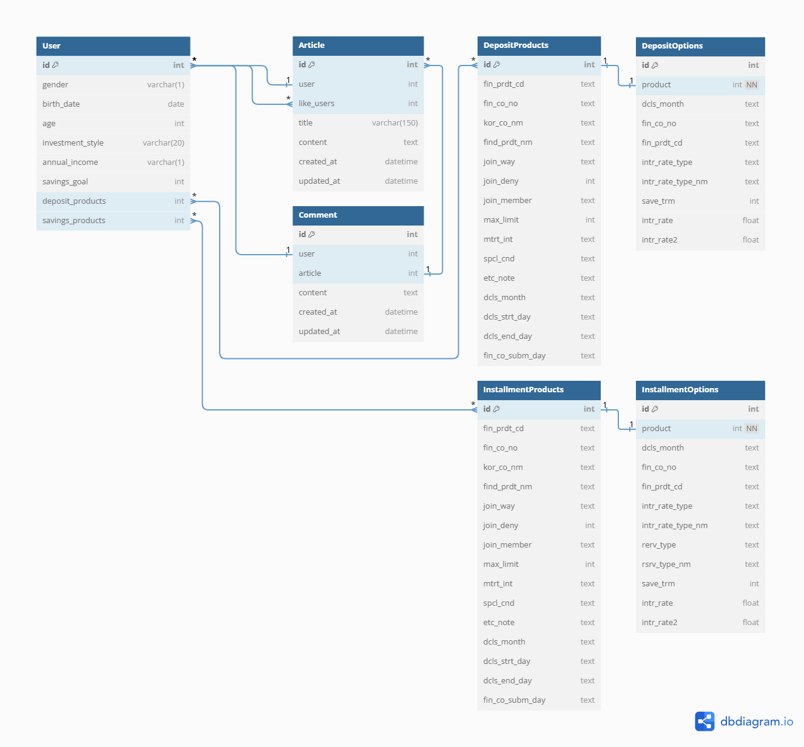

## 🌳 Component Tree
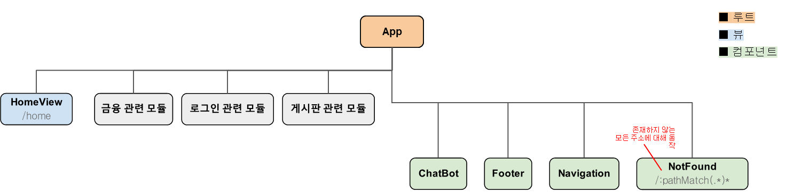
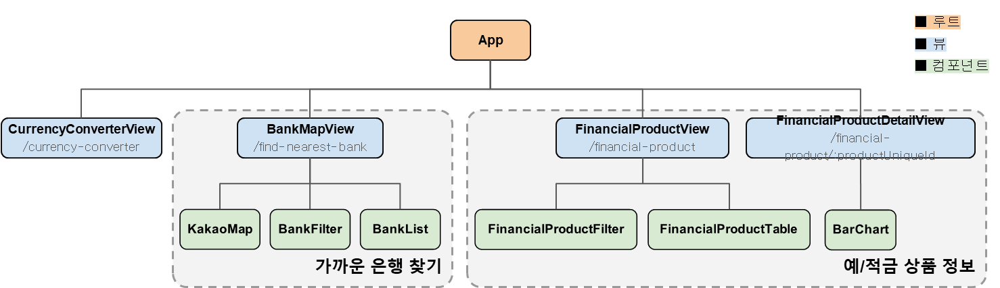
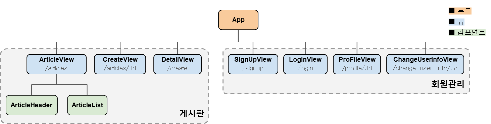

## 🎥 서비스 기능 프리뷰

### 1. 메인 페이지

[mainpage.webm](https://github.com/user-attachments/assets/21514e1f-a1fb-4d2c-8847-0f7c4be73f5a)

- 메인 페이지에서 예금 및 적금 상품 조회, 가까운 은행 찾기, 환율 계산기, 챗봇 기능 제공

- - -

### 2. 환율 계산기

[02_calc.webm](https://github.com/user-attachments/assets/40058cfd-52f7-43a6-95e7-4c4ed19bc3bf)

- 원하는 국가의 통화를 선택 후 금액을 입력하면 자동 환전 계산
- 입력란에 따라서 자동으로 계산이 반영
(ex. 미국 달러를 선택한 경우, 원화 입력칸의 값을 수정 -> 미국 달러 값이 계산 / 미국 달러칸의 값을 수정 -> 원화 값이 계산되어 보임)

  
  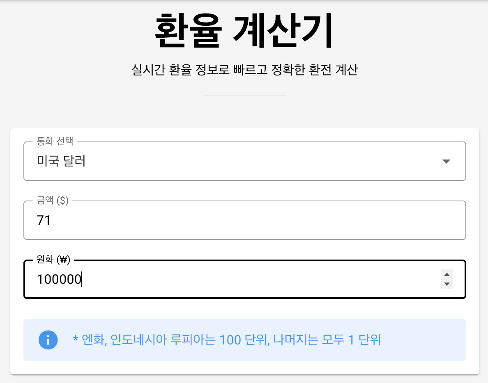

- - -

### 3. 가까운 은행 찾기

[03_bank.webm](https://github.com/user-attachments/assets/9a5d6b31-1ba2-4c86-98cf-fb905a75d643)

- 광역시/도, 시/군/구, 은행명을 선택하여 해당 지역의 원하는 은행을 조회
- 조회 버튼을 클릭하면 해당 위치로 포커스가 이동
- 지도에 표시된 위치를 클릭하면 해당 위치의 은행 위치 정보를 확인 가능

  

- - -

### 4.금융상품 전체 조회

[04_finance_inquiry_all.webm](https://github.com/user-attachments/assets/ba459d6d-3eaf-41a7-821d-ac1bc8393814)

- 전체 예금 및 적금 상품을 조회할 수 있는 기능
- 필터 기능을 추가해 상품 구분(예적금), 은행 브랜드, 저축 기간을 필터링하여 원하는 상품 조회 가능

  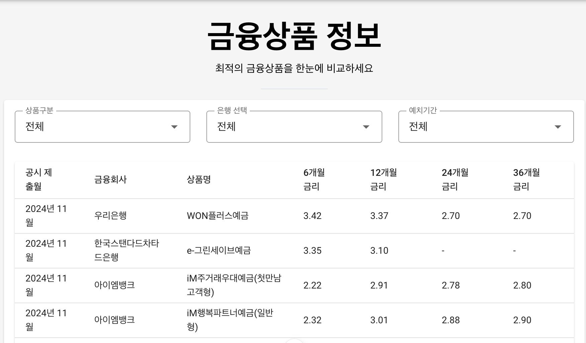

- - -

### 5. 금융상품 상세 조회

[05_finance_inquiry_detail.webm](https://github.com/user-attachments/assets/a7b6859d-afdb-425e-a401-104de3a2bb75)

- 금융 상품에 대한 상세한 정보를 제공
- 저축 기간에 따른 금리 차트 제공
- 로그인한 유저에 한해 상품 가입 및 해지 버튼이 활성화

  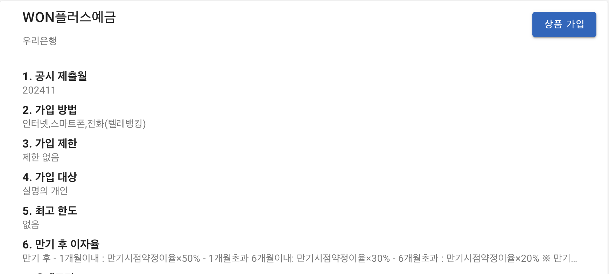
   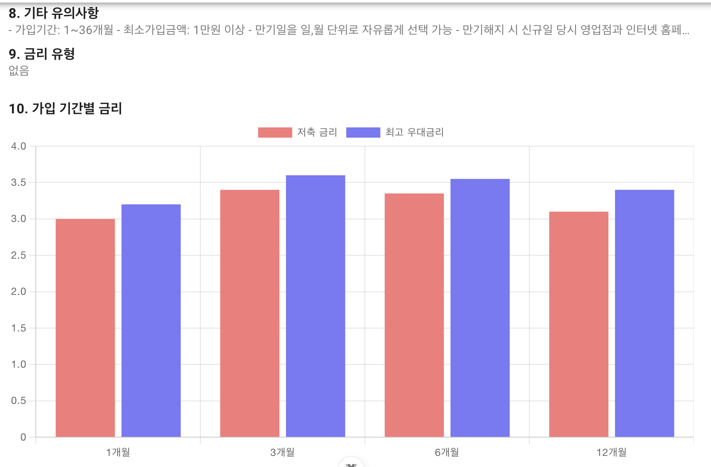

- - -

### 6. 상품 추천

[15_recommendation.webm](https://github.com/user-attachments/assets/ae1c300b-0e40-4f5d-89b4-b77b752b62ac)

- 추가정보(주거래은행, 예금, 적금 상품 가입 수)를 입력하면 자신과 비슷한 회원이 가입한 상품 추천

  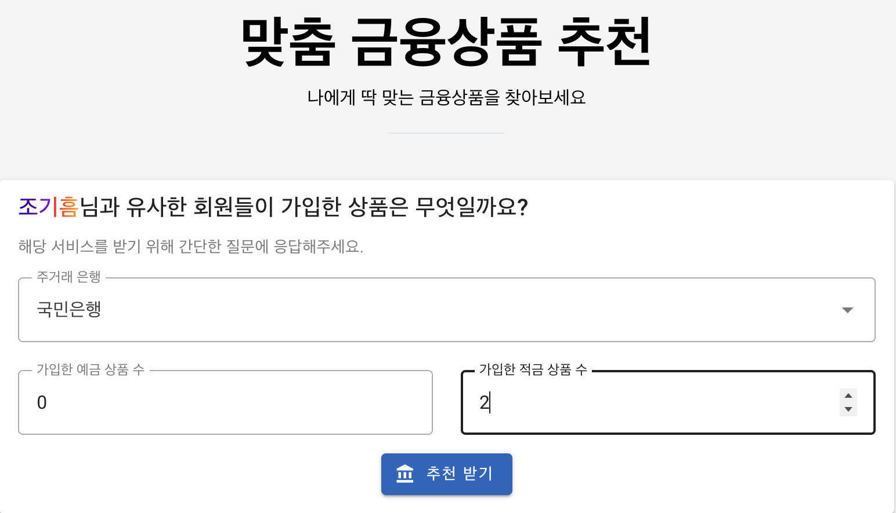
  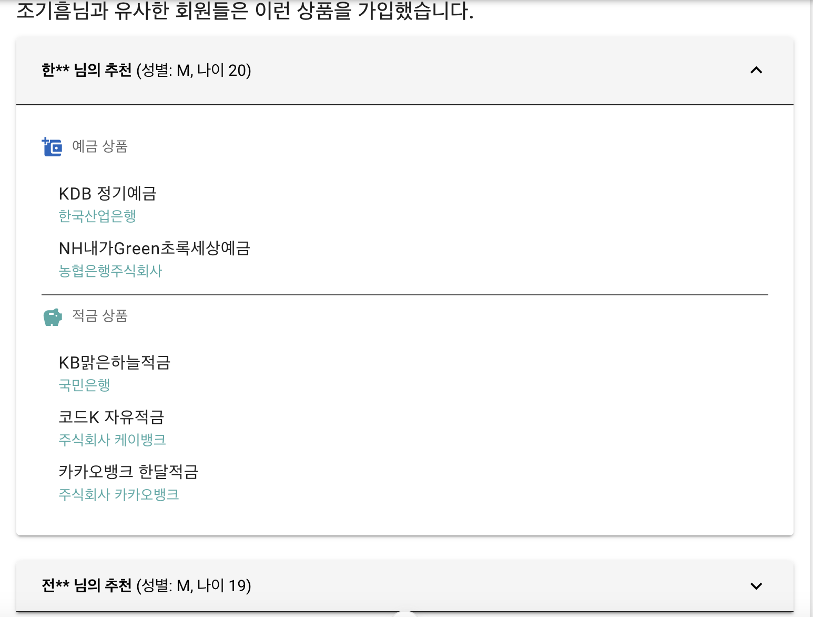

- **상품 추천 알고리즘**

    1. **알고리즘** : 코사인 유사도를 활용한 유저 기반 협업 필터링
    1. **사용한 유저 특성** : 나이, 성별, 주거래은행, 투자 성향, 연간 평균 수입, 예금 가입 상품 수, 적금 가입 상품 수
    1. **사용 모듈** : scikit-learn의 cosine-similarity활용
    1. **유사도 계산** : cosine-similarity를 통해 구해진 유저 유사도를 정렬해서 3명 선택
    1. **상품 추천** : 위에서 구한 3명이 가입한 예금 / 적금 상품 추천

- - -

### 7. 게시글 생성

[06_new_article.webm](https://github.com/user-attachments/assets/ae8bf885-c81b-4bc8-bd10-2c71e9b5bd64)

- 유저 간 금융 정보를 공유할 수 있는 커뮤니티 공간

- - -

### 8. 게시글 상세 조회

[07_article_detail.webm](https://github.com/user-attachments/assets/7d072e28-856c-4400-896b-44ff3b944f8d)

- - -

### 9. 게시글 수정

[08_update_article.webm](https://github.com/user-attachments/assets/1d7dfd4c-0ae0-44c7-ace1-2ac097b90fca)

- - -

### 10. 댓글 생성, 수정, 삭제

[09_comments.webm](https://github.com/user-attachments/assets/6dae7dd5-4817-4ca0-81e6-405cca2efae0)

- 댓글 기능을 구현해 게시글 상세 보기 페이지에서 댓글 작성 가능
- 댓글 작성자와 로그인한 유저가 동일할 때만 수정 및 삭제 버튼 활성화

- - -

### 11. 권한에 따른 수정/삭제 제한

[10_article_auth.webm](https://github.com/user-attachments/assets/2e9e8f38-d9c4-4002-ad62-2bb3281f99d8)

- 작성자와 로그인한 유저가 동일할 때만 수정 및 삭제 버튼 활성화

- - -

### 12. 회원가입

[11_singup.webm](https://github.com/user-attachments/assets/ad301329-b49e-47c5-8eeb-8e924e3591d7)

- user모델 커스텀을 통해 필드 추가

  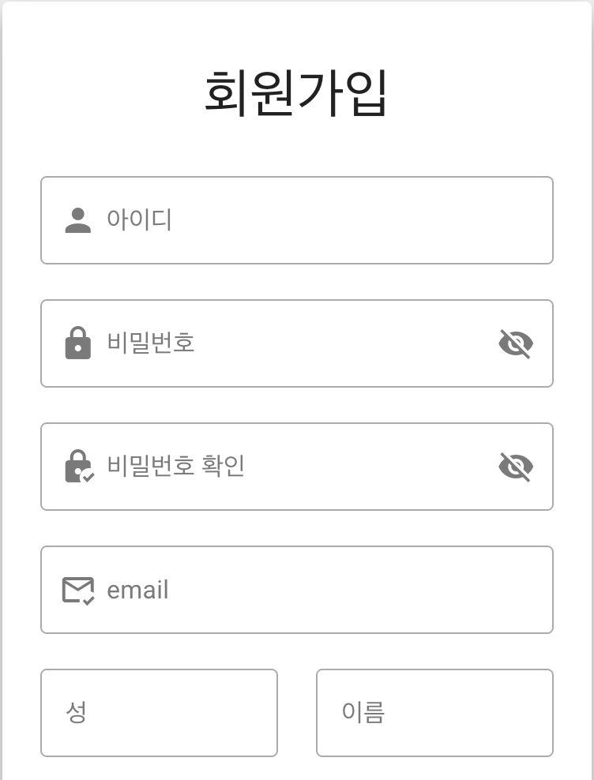
  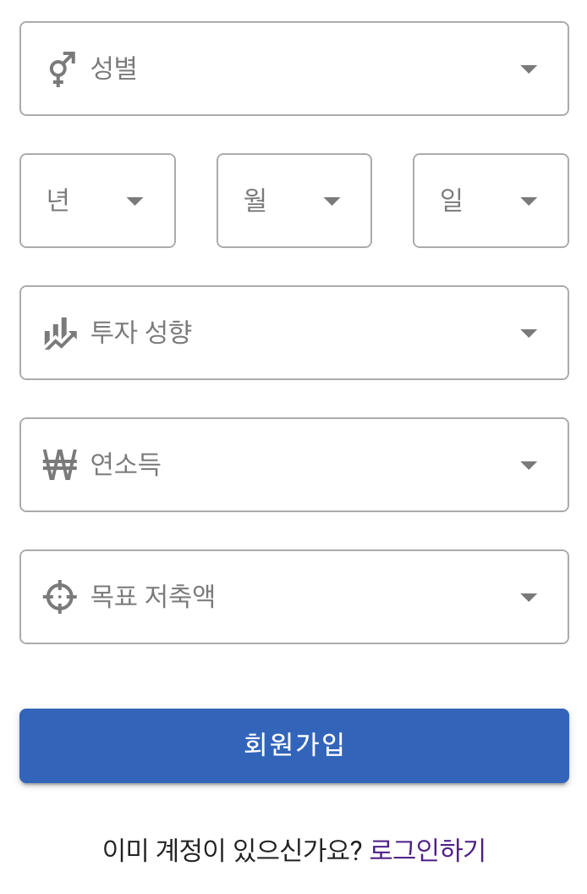

- - -

### 13. 로그인, 로그아웃

[12_login_logout.webm](https://github.com/user-attachments/assets/ce3e0bb1-5ff1-4dac-a87a-f4ffa5b173c3)

- - -

### 14. 프로필 페이지, 회원 정보 수정

[13_profile_update_user_info.webm](https://github.com/user-attachments/assets/1250ade3-50a4-4f3e-8acd-3ef446f4de39)

- 프로필 페이지에서 회원 정보 조회, 수정, 회원 탈퇴 가능

  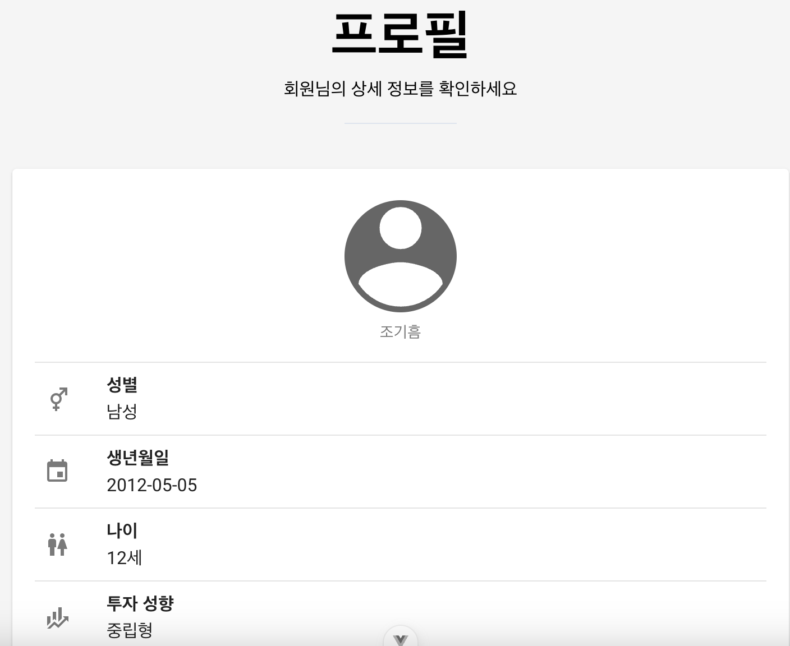
  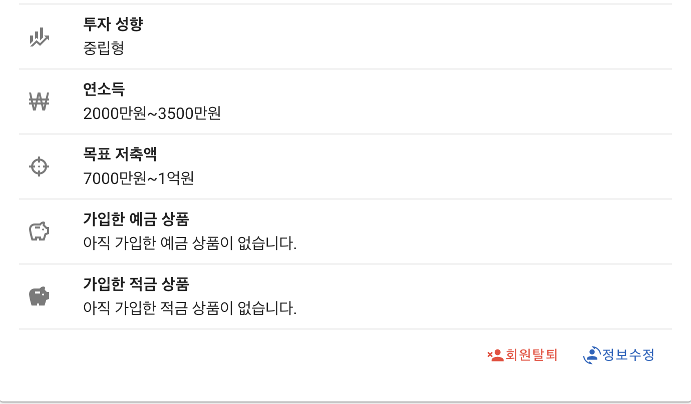

  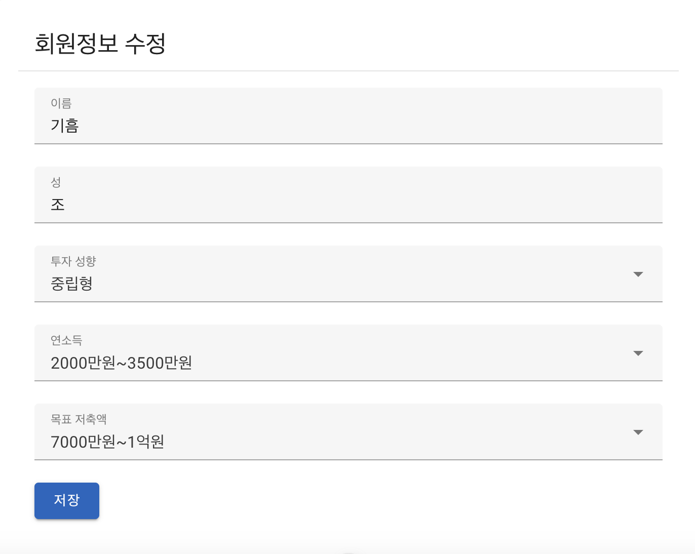

- - -

### 15. 회원 탈퇴

[14_signout.webm](https://github.com/user-attachments/assets/b1af59a5-71ac-4e40-a93a-b863d662b3d5)

- - -

### 16. 챗봇

> *API Key 문제로 시연 영상 촬영 불가*

[chatbot.webm](https://github.com/user-attachments/assets/1f7d56b5-b127-427a-8264-426168c03849)

- 웹 서비스 사용 편의성 향상을 위해 기능을 문의하면 관련 링크를 제시

- - -

## 💡 배운점

### 조현준
- 협업 과정에서 소통의 중요성을 깨달았으며, git-flow를 준수하는 개발법, git 충돌이 발생했을 때 해결하는 방법, 문제 해결을 위한 커뮤니케이션 능력을 향상시킬 수 있었다.
- AI의 발전에 따라 개발 효율성이 극대화된 것은 사실이나 코딩에 대한 지식 없이 남용하는 것은 오히려 독이 된다는 것을 깨달았다.

### 조기흠
- 

## 📝 백엔드 명세서

### 🔐 인증 관련 API

| Method | URL                 | Description | Request | Response |
| ------ | ------------------- | ----------- | ------- | -------- |
| POST   | `/accounts/signup/` | 회원가입    | -       | -        |
| POST   | `/accounts/`        | 로그인      | -       | -        |
| POST   | `/accounts/logout/` | 로그아웃    | -       | -        |

### 👤 사용자 관련 API

| Method | URL                           | Description              | Request     | Response                       |
| ------ | ----------------------------- | ------------------------ | ----------- | ------------------------------ |
| GET    | `/user/`                      | 현재 유저 정보 조회      | -           | User 정보                      |
| GET    | `/user/detail/<int:user_pk>/` | 특정 유저 상세 정보 조회 | -           | User 정보, 예금/적금 상품 정보 |
| DELETE | `/user/detail/<int:user_pk>/` | 회원 탈퇴                | -           | -                              |
| PUT    | `/user/detail/<int:user_pk>/` | 회원 정보 수정           | 수정할 정보 | 수정된 User 정보               |

### 📝 게시판 관련 API

| Method | URL                                    | Description      | Request     | Response         |
| ------ | -------------------------------------- | ---------------- | ----------- | ---------------- |
| GET    | `/articles/`                           | 게시글 목록 조회 | -           | 게시글 목록      |
| POST   | `/articles/`                           | 게시글 작성      | 게시글 내용 | 작성된 게시글    |
| GET    | `/articles/<int:article_pk>/`          | 게시글 상세 조회 | -           | 게시글 상세 정보 |
| PUT    | `/articles/<int:article_pk>/`          | 게시글 수정      | 수정할 내용 | 수정된 게시글    |
| DELETE | `/articles/<int:article_pk>/`          | 게시글 삭제      | -           | -                |
| POST   | `/articles/<int:article_pk>/comments/` | 댓글 작성        | 댓글 내용   | 작성된 댓글      |
| PUT    | `/articles/comments/<int:comment_pk>/` | 댓글 수정        | 수정할 내용 | 수정된 댓글      |
| DELETE | `/articles/comments/<int:comment_pk>/` | 댓글 삭제        | -           | -                |

### 💰 금융 상품 관련 API

| Method | URL                                          | Description              | Request                            | Response            |
| ------ | -------------------------------------------- | ------------------------ | ---------------------------------- | ------------------- |
| GET    | `/finances/save-deposits/`                   | 정기예금 상품 저장       | -                                  | 저장된 상품 수      |
| GET    | `/finances/save-installments/`               | 적금 상품 저장           | -                                  | 저장된 상품 수      |
| GET    | `/finances/infos/`                           | 전체 금융 상품 조회      | -                                  | 예금/적금 상품 목록 |
| GET    | `/finances/infos/<str:product_id>/`          | 특정 금융 상품 상세 조회 | -                                  | 상품 상세 정보      |
| POST   | `/finances/subscribe/`                       | 금융 상품 구독/취소      | category, id                       | 구독 상태 메시지    |
| POST   | `/finances/recommend-finance/<int:user_id>/` | 금융 상품 추천           | mainbank, deposit_cnt, savings_cnt | 추천 상품 정보      |

### 🤖 챗봇 관련 API

| Method | URL              | Description | Request  | Response        |
| ------ | ---------------- | ----------- | -------- | --------------- |
| POST   | `/chatbot/chat/` | GPT와 대화  | messages | GPT 응답 메시지 |

## 📱 프론트엔드 명세서

### 인증 관련 API

| Method | URL                 | Description   | Request                                                                                                                                    | Response                                                                                  |
| ------ | ------------------- | ------------- | ------------------------------------------------------------------------------------------------------------------------------------------ | ----------------------------------------------------------------------------------------- |
| POST   | `/user/login/`      | 로그인        | `{ username, password }`                                                                                                                   | `{ token }`                                                                               |
| POST   | `/user/signup/`     | 회원가입      | `{ username, password1, password2, email, first_name, last_name, gender, birth_date, age, investment_style, annual_income, savings_goal }` | `{ token }`                                                                               |
| GET    | `/user/detail/:id/` | 회원정보 조회 | -                                                                                                                                          | `{ user: { first_name, last_name, investment_style, annual_income, savings_goal, ... } }` |
| PUT    | `/user/detail/:id/` | 회원정보 수정 | `{ first_name, last_name, investment_style, annual_income, savings_goal }`                                                                 | `{ message: "success" }`                                                                  |
| DELETE | `/user/detail/:id/` | 회원탈퇴      | -                                                                                                                                          | -                                                                                         |

### 게시판 관련 API

| Method | URL                       | Description      | Request Body           | Response                                                        |
| ------ | ------------------------- | ---------------- | ---------------------- | --------------------------------------------------------------- |
| GET    | `/articles/`              | 게시글 목록 조회 | -                      | `[{ id, title, content, username, created_at, ... }]`           |
| GET    | `/articles/:id/`          | 게시글 상세 조회 | -                      | `{ id, title, content, username, created_at, comments: [...] }` |
| POST   | `/articles/`              | 게시글 작성      | `{ title, content }`   | `{ id, title, content }`                                        |
| PUT    | `/articles/:id/`          | 게시글 수정      | `{ content }`          | `{ message: "success" }`                                        |
| DELETE | `/articles/:id/`          | 게시글 삭제      | -                      | -                                                               |
| POST   | `/articles/comments/`     | 댓글 작성        | `{ content, article }` | `{ id, content }`                                               |
| DELETE | `/articles/comments/:id/` | 댓글 삭제        | -                      | -                                                               |

### 금융 상품 관련 API

| Method | URL                                    | Description        | Request Body                             | Response                                             |
| ------ | -------------------------------------- | ------------------ | ---------------------------------------- | ---------------------------------------------------- |
| GET    | `/finances/products/`                  | 금융상품 목록 조회 | -                                        | `[{ id, fin_prdt_nm, kor_co_nm, ... }]`              |
| GET    | `/finances/products/:productUniqueId/` | 금융상품 상세 조회 | -                                        | `{ id, fin_prdt_nm, kor_co_nm, options: [...] }`     |
| POST   | `/finances/recommend-finance/:id/`     | 금융상품 추천      | `{ mainbank, deposit_cnt, savings_cnt }` | `{ depositproducts: [...], savingsproducts: [...] }` |
| POST   | `/finances/subscribe/`                 | 상품 구독/해지     | `{ category, id }`                       | `{ message: "success" }`                             |

### 환율 관련 API

| Method | URL                                                             | Description    | Request Body | Response                        |
| ------ | --------------------------------------------------------------- | -------------- | ------------ | ------------------------------- |
| GET    | `${EXCHANGE_RATE_SERVER_URL}/${API_KEY}/latest/${baseCurrency}` | 환율 정보 조회 | -            | `{ conversion_rates: { ... } }` |

### 지도 관련 API

| Method | URL           | Description    | Request Body               | Response                        |
| ------ | ------------- | -------------- | -------------------------- | ------------------------------- |
| GET    | `/map/search` | 은행 위치 검색 | `{ province, city, bank }` | `[{ name, address, lat, lng }]` |

### 챗봇 관련 API

| Method | URL                | Description      | Request Body  | Response               |
| ------ | ------------------ | ---------------- | ------------- | ---------------------- |
| POST   | `/chatbot/message` | 챗봇 메시지 전송 | `{ message }` | `{ response: String }` |
