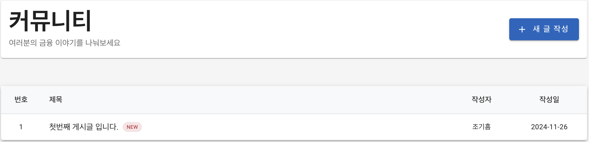
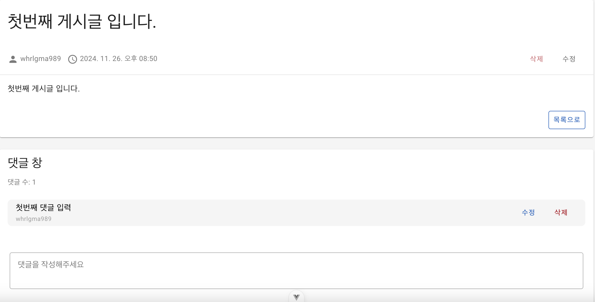

# 프로젝트 소개

**금융 서비스 웹 개발 프로젝트**

## 팀원 소개

- 조현준 : 팀장
- 조기흠 : 팀원

## 역할 소개

### 조현준

1. **금융 상품 조회**

- 예금 & 적금 상품 조회
- 예금 & 적금 상품 상세 조회
- 필터 기능 구현

2. **가까운 은행 찾기**

- 시/군/구 및 은행 선택시 지도에 은행 위치 표시
- 카카오 맵 API 활용

3. **환율 계산기**

- exchange rate API 활용
- 국가 선택 후, 원화 또는 해당 국가 화폐 입력 시, 환율 자동 계산

4. **챗봇**

- Open AI API 활용
- 웹 서비스 관련 링크나 사용서 관련 챗봇

5. veutify3 layout 설계 및 디자인 총괄

### 조기흠

1. **회원**

- 회원 가입, 탈퇴, 정보 수정
- 로그인/로그아웃
- 프로필

2. **게시판**

- 게시글 생성, 조회, 수정, 삭제
- 댓글 생성, 조회, 수정, 삭제

3. **추천시스템**

- pandas 및 scikit-learn을 활용한 데이터 분석
- 코사인 유사도를 활용한 유저 기반 협업 필터링 추천 모델 설계

## ERD

## Component Tree

아직 안넣음

## 서비스 기능 상세

1. 금융 상품 조회

- 전체 금융 상품(예적금 상품) 조회
- 필터 기능을 추가해 예/적금 및 은행 및 기간을 통해 원하는 상품 조회 가능

  

- 금융 상세 조회(차트를 통해 기간 별 금리 비교)

  
   

- 가입하기 기능

1. 가까운 은행 찾기

- 광역시/도, 시/군/구, 은행명을 통해 해당 지역의 원하는 은행을 찾기

  

1. 환율 계산기

- 원하는 국가를 선택 후 금액을 입력하면 자동 환전 계산
- 예) 원화 입력 -> 미국 달러 or 미국 달러 입력 -> 원화

  
  

1. 챗봇

- 웹 서비스 기능을 물어보면 링크를 보내주는(웹 서비스 사용 편리성 향상)

1. 회원

- 회원 가입
- user모델 커스텀을 통해 필드 추가

  
  

- 로그인 / 로그아웃
- 프로필

  
  

- 회원정보 수정

  

- 회원탈퇴

6. 금융 상품 추천

- 추가정보(주거래은행, 예금, 적금 상품 가입 수)를 입력하면 자신과 비슷한 회원이 가입한 상품 추천

  
  

7. 상품 추천 알고리즘

- 알고리즘 : 코사인 유사도를 활용한 유저 기반 협업 필터링
- 사용한 유저 특성 : 나이, 성별, 주거래은행, 투자 성향, 연간 평균 수입, 예금 가입 상품 수, 적금 가입 상품 수
- scikit-learn의 cosine-similarity활용
- cosine-similarity를 통해 구해진 유저 유사도를 정렬해서 3명 선택
- 위에서 구한 3명이 가입한 예금 / 적금 상품 추천

8. 커뮤니티 게시판

- 유저 간 금융 정보를 공유할 수 있는 커뮤니티 공간
- 작성자와 로그인한 유저가 동일할 때만 수정 및 삭제 버튼 활성화
- 댓글 기능을 구현해 게시글 상세 보기 페이지에서 댓글 작성 가능
- 댓글도 작성자와 로그인한 유저가 동일할 때만 수정 및 삭제 버튼 활성화

  
  

## 시연 영상

### 1. 메인 페이지

<!-- <video width='1280' controls>
  <source src='assets/video/01_mainpage.mp4' type='video/mp4'/>
</video> -->

[](https://github.com/Meista765/ssafy-projects/blob/dev/assets/video/01_mainpage.mp4)

### 2. 환율 계산기

### 3. 가까운 은행 찾기

### 4.금융상품 전체 조회

### 5. 금융상품 상세 조회

### 6. 게시글 생성

### 7. 게시글 상세 조회

### 8. 게시글 수정

### 9. 댓글 생성, 수정, 삭제

### 10. 권한에 따른 수정/삭제 제한

### 11. 회원가입

### 12. 로그인, 로그아웃

### 13. 프로필 페이지, 회원 정보 수정

### 14. 회원 탈퇴

### 15. 상품 추천

## 배운점

- 조현준

- 조기흠

## 백엔드 명세서

### 🔐 인증 관련 API

| Method | URL | Description | Request | Response |
| - | - | - | - | - |
| POST | `/accounts/signup/` | 회원가입 | - | - |
| POST | `/accounts/` | 로그인 | - | - |
| POST | `/accounts/logout/` | 로그아웃 | - | - |

### 👤 사용자 관련 API

| Method | URL | Description | Request | Response |
| - | - | - | - | - |
| GET | `/user/` | 현재 유저 정보 조회 | - | User 정보 |
| GET | `/user/detail/<int:user_pk>/` | 특정 유저 상세 정보 조회 | - | User 정보, 예금/적금 상품 정보 |
| DELETE | `/user/detail/<int:user_pk>/` | 회원 탈퇴 | - | - |
| PUT | `/user/detail/<int:user_pk>/` | 회원 정보 수정 | 수정할 정보 | 수정된 User 정보 |

### 📝 게시판 관련 API

| Method | URL | Description | Request | Response |
| - | - | - | - | - |
| GET | `/articles/` | 게시글 목록 조회 | - | 게시글 목록 |
| POST | `/articles/` | 게시글 작성 | 게시글 내용 | 작성된 게시글 |
| GET | `/articles/<int:article_pk>/` | 게시글 상세 조회 | - | 게시글 상세 정보 |
| PUT | `/articles/<int:article_pk>/` | 게시글 수정 | 수정할 내용 | 수정된 게시글 |
| DELETE | `/articles/<int:article_pk>/` | 게시글 삭제 | - | - |
| POST | `/articles/<int:article_pk>/comments/` | 댓글 작성 | 댓글 내용 | 작성된 댓글 |
| PUT | `/articles/comments/<int:comment_pk>/` | 댓글 수정 | 수정할 내용 | 수정된 댓글 |
| DELETE | `/articles/comments/<int:comment_pk>/` | 댓글 삭제 | - | - |

### 💰 금융 상품 관련 API

| Method | URL | Description | Request | Response |
| - | - | - | - | - |
| GET | `/finances/save-deposits/` | 정기예금 상품 저장 | - | 저장된 상품 수 |
| GET | `/finances/save-installments/` | 적금 상품 저장 | - | 저장된 상품 수 |
| GET | `/finances/infos/` | 전체 금융 상품 조회 | - | 예금/적금 상품 목록 |
| GET | `/finances/infos/<str:product_id>/` | 특정 금융 상품 상세 조회 | - | 상품 상세 정보 |
| POST | `/finances/subscribe/` | 금융 상품 구독/취소 | category, id | 구독 상태 메시지 |
| POST | `/finances/recommend-finance/<int:user_id>/` | 금융 상품 추천 | mainbank, deposit_cnt, savings_cnt | 추천 상품 정보 |

### 🤖 챗봇 관련 API

| Method | URL | Description | Request | Response |
| - | - | - | - | - |
| POST | `/chatbot/chat/` | GPT와 대화 | messages | GPT 응답 메시지 |

## 프론트엔드 명세서

### 인증 관련 API

| Method | URL | Description | Request | Response |
| - | - | - | - | - |
| POST | `/user/login/` | 로그인 | `{ username, password }` | `{ token }` |
| POST | `/user/signup/` | 회원가입 | `{ username, password1, password2, email, first_name, last_name, gender, birth_date, age, investment_style, annual_income, savings_goal }` | `{ token }` |
| GET | `/user/detail/:id/` | 회원정보 조회 | - | `{ user: { first_name, last_name, investment_style, annual_income, savings_goal, ... } }` |
| PUT | `/user/detail/:id/` | 회원정보 수정 | `{ first_name, last_name, investment_style, annual_income, savings_goal }` | `{ message: "success" }` |
| DELETE | `/user/detail/:id/` | 회원탈퇴 | - | - |

### 게시판 관련 API

| Method | URL | Description | Request Body | Response |
| - | - | - | - | - |
| GET | `/articles/` | 게시글 목록 조회 | - | `[{ id, title, content, username, created_at, ... }]` |
| GET | `/articles/:id/` | 게시글 상세 조회 | - | `{ id, title, content, username, created_at, comments: [...] }` |
| POST | `/articles/` | 게시글 작성 | `{ title, content }` | `{ id, title, content }` |
| PUT | `/articles/:id/` | 게시글 수정 | `{ content }` | `{ message: "success" }` |
| DELETE | `/articles/:id/` | 게시글 삭제 | - | - |
| POST | `/articles/comments/` | 댓글 작성 | `{ content, article }` | `{ id, content }` |
| DELETE | `/articles/comments/:id/` | 댓글 삭제 | - | - |

### 금융 상품 관련 API

| Method | URL | Description | Request Body | Response |
| - | - | - | - | - |
| GET | `/finances/products/` | 금융상품 목록 조회 | - | `[{ id, fin_prdt_nm, kor_co_nm, ... }]` |
| GET | `/finances/products/:productUniqueId/` | 금융상품 상세 조회 | - | `{ id, fin_prdt_nm, kor_co_nm, options: [...] }` |
| POST | `/finances/recommend-finance/:id/` | 금융상품 추천 | `{ mainbank, deposit_cnt, savings_cnt }` | `{ depositproducts: [...], savingsproducts: [...] }` |
| POST | `/finances/subscribe/` | 상품 구독/해지 | `{ category, id }` | `{ message: "success" }` |

### 환율 관련 API

| Method | URL | Description | Request Body | Response |
| - | - | - | - | - |
| GET | `${EXCHANGE_RATE_SERVER_URL}/${API_KEY}/latest/${baseCurrency}` | 환율 정보 조회 | - | `{ conversion_rates: { ... } }` |

### 지도 관련 API

| Method | URL | Description | Request Body | Response |
| - | - | - | - | - |
| GET | `/map/search` | 은행 위치 검색 | `{ province, city, bank }` | `[{ name, address, lat, lng }]` |

### 챗봇 관련 API

| Method | URL | Description | Request Body | Response |
| - | - | - | - | - |
| POST | `/chatbot/message` | 챗봇 메시지 전송 | `{ message }` | `{ response: String }` |
